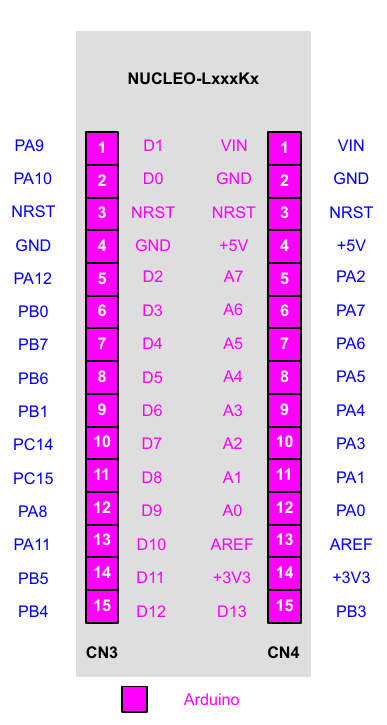

---
jupytext:
  formats: md:myst
  text_representation:
    extension: .md
    format_name: myst
    format_version: 0.13
    jupytext_version: 1.11.5
kernelspec:
  display_name: Python 3
  language: python
  name: python3
---

# STM32 Nucleo-32 

Vývojový modul Nucleo-32 jr pinovo kompatibilný s Arduino-Nano.

Mapovanie pinov MicroPython-u pre Nucleo32 STM32L432.

 

##  GPIO 

Mapovanie pinov GPIO je uvedené v súbore [pins_L432.csv](./doc/pins_L432.csv)**. Mapovanie GPIO Periférií:

    / UART config
    #define MICROPY_HW_UART1_TX     (pin_B6)
    #define MICROPY_HW_UART1_RX     (pin_B7)
    #define MICROPY_HW_UART2_TX     (pin_A2)  // VCP TX
    #define MICROPY_HW_UART2_RX     (pin_A15) // VCP RX
    
    #define MICROPY_HW_UART_REPL        PYB_UART_2
    #define MICROPY_HW_UART_REPL_BAUD   115200
    
    #define MICROPY_HW_FLASH_LATENCY    FLASH_LATENCY_4
    
    // I2C buses
    #define MICROPY_HW_I2C1_SCL (pin_A9)
    #define MICROPY_HW_I2C1_SDA (pin_A10)
    #define MICROPY_HW_I2C3_SCL (pin_A7)
    #define MICROPY_HW_I2C3_SDA (pin_B4)
    
    // SPI buses
    #define MICROPY_HW_SPI1_NSS     (pin_B0)
    #define MICROPY_HW_SPI1_SCK     (pin_A5)
    #define MICROPY_HW_SPI1_MISO    (pin_A6)
    #define MICROPY_HW_SPI1_MOSI    (pin_A7)
    #define MICROPY_HW_SPI3_NSS     (pin_A4)
    #define MICROPY_HW_SPI3_SCK     (pin_B3)
    #define MICROPY_HW_SPI3_MISO    (pin_B4)
    #define MICROPY_HW_SPI3_MOSI    (pin_B5)
    
    // LEDs
    #define MICROPY_HW_LED1             (pin_B3) // Green LD3 LED on Nucleo

##  Doplnenia  
    
Flash problem

    https://github.com/micropython/micropython/issues/6605
    https://github.com/micropython/micropython/pull/4330

Vytvorenie vfs

    >>> import os, pyb
    >>> os.umount('/flash')
    >>> os.VfsLfs1.mkfs(pyb.Flash(start=0))
    >>> os.mount(pyb.Flash(start=0), '/flash')
    >>> os.listdir()
    ['flash']
    >>> 

    
    
