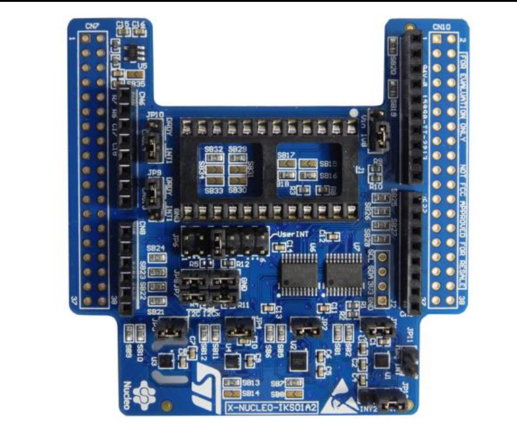

---
jupytext:
  formats: md:myst
  text_representation:
    extension: .md
    format_name: myst
    format_version: 0.13
    jupytext_version: 1.11.5
kernelspec:
  display_name: Python 3
  language: python
  name: python3
---

# MEMS Senzory 

Doplnkový STM modul s MEMS senzormi. 

**Dokumentácia**

Dokumentácia k modulu 

*  [X-NUCLEO-IKS01A2 - Motion MEMS and environmental sensor expansion board](./doc/x-nucleo-iks01a2.pdf)

Dokumentácia k senzorom

*  [LSM6DSOX - 3-axis accelerometer and 3-axis gyroscope](./doc/lsm6dsox.pdf)
*  [LSM6DSL - 3D accelerometer and 3D gyroscope](./doc/lsm6dsl.pdf)
*  [LSM303AGR - 3-axis accelerometer and 3-axis magnetometer](./doc/lsm303agr.pdf)
*  [HTS221 - Capacitive digital sensor for relative humidity and temperature](./doc/hts221.pdf)

Knižnice pre obsluhu senzorov modulu.

* [lib_lsm6ds3.py](./lib/lib_lsm6ds3.py)
* [lib_hts221.py](./lib/lib_hts221.py)
* [lib_lps22.py](./lib/lib_lps22.py)
* [lib_lsm303agr_mag.py](./lib/lib_lsm303agr_mag.py)

**Adresácia komponentov**

    Senzory majú priradené pevné adresy
    7-bitove adresy (bez bitového posunu)

    0x6D  107   LSM6DSL    akcelometer a gyroskop

    0x5F   95   HTS221     teplomer a vlhkomer

    0x5D   93   LPS22HB    tlakomer

    0x1e   30   LSM303AGH  akcelerometer
    0x19   25   LSM303AGH  magneticky senzor

## Programovanie

Nahratie knižníc

    python pyboard.py -f cp lib_lsm6ds3.py :lib_lsm6ds3.py
    python pyboard.py -f cp lib_hts221.py :lib_hts221.py
    python pyboard.py -f cp lib_lps22.py :lib_lps22.py
    python pyboard.py -f cp lib_lsm303agr_mag.py :lib_lsm303agr_mag.py

### LSM6DSL - Akcelerometer a gyroskop

    import math
    import time 
    from pyb import I2C
    from lib_lsm6ds3 import *

    i2c = I2C(1, I2C.CONTROLLER, baudrate=400000)   # inicializacia rozhrania
    print('Kontrola zariadeni na zbernici :', i2c.scan())
    
    sensor = LSM6DS3(i2c, address=107, mode=PERFORMANCE_MODE_416HZ) #mode=NORMAL_MODE_104HZ)
    for i in range(10):
        ax, ay, az, gx, gy, gz = sensor.get_readings()
        print(ax, ay, az)
        print(gx, gy, gz, math.sqrt(ax**2 + ay**2 + az**2)*0.061 )
        print()
        

### HTS221 - Teplomer a vlhkomer

    import math
    import time 
    from pyb import I2C
    from lib_hts221 import *

    i2c = I2C(1, I2C.CONTROLLER, baudrate=400000)   # inicializacia rozhrania
    print('Kontrola zariadeni na zbernici :', i2c.scan())
    
    hts = HTS221(i2c)
    for i in range(10):
        hts.get()

### LPS22HB - Tlakomer

    import math
    import time 
    from pyb import I2C
    from lib_lps22 import *

    i2c = I2C(1, I2C.CONTROLLER, baudrate=400000)   # inicializacia rozhrania
    print('Kontrola zariadeni na zbernici :', i2c.scan())
    
    lps = LPS22(i2c)
    time.sleep(0.1)
    for i in range(10):
      lps.get()
      

### LSM303AGH - Magnetometer

    import math
    import time 
    from pyb import I2C
    from lib_lsm303agr_mag import *

    i2c = I2C(1, I2C.CONTROLLER, baudrate=400000)   # inicializacia rozhrania
    print('Kontrola zariadeni na zbernici :', i2c.scan())
    
    mag = LSM303AGR_MAG(i2c)
    for i in range(10):
      print(mag.magnetic())
